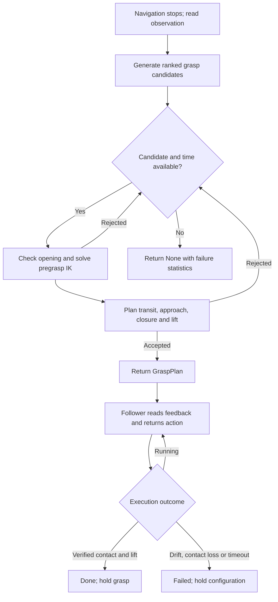

```mermaid
---
config:
  theme: default
---
flowchart TD
    A["Navigation stops; read observation"] --> B["Generate ranked grasp candidates"]
    B --> C{"Candidate and time available?"}
    C -->|Yes| D["Check opening and solve pregrasp IK"]
    D --> E["Plan transit, approach, closure and lift"]
    D -->|Rejected| C
    E -->|Rejected| C
    E -->|Accepted| F["Return GraspPlan"]
    C -->|No| G["Return None with failure statistics"]
    F --> H["Follower reads feedback and returns action"]
    H --> I{"Execution outcome"}
    I -->|Running| H
    I -->|Verified contact and lift| J["Done; hold grasp"]
    I -->|Drift, contact loss or timeout| K["Failed; hold configuration"]
```

